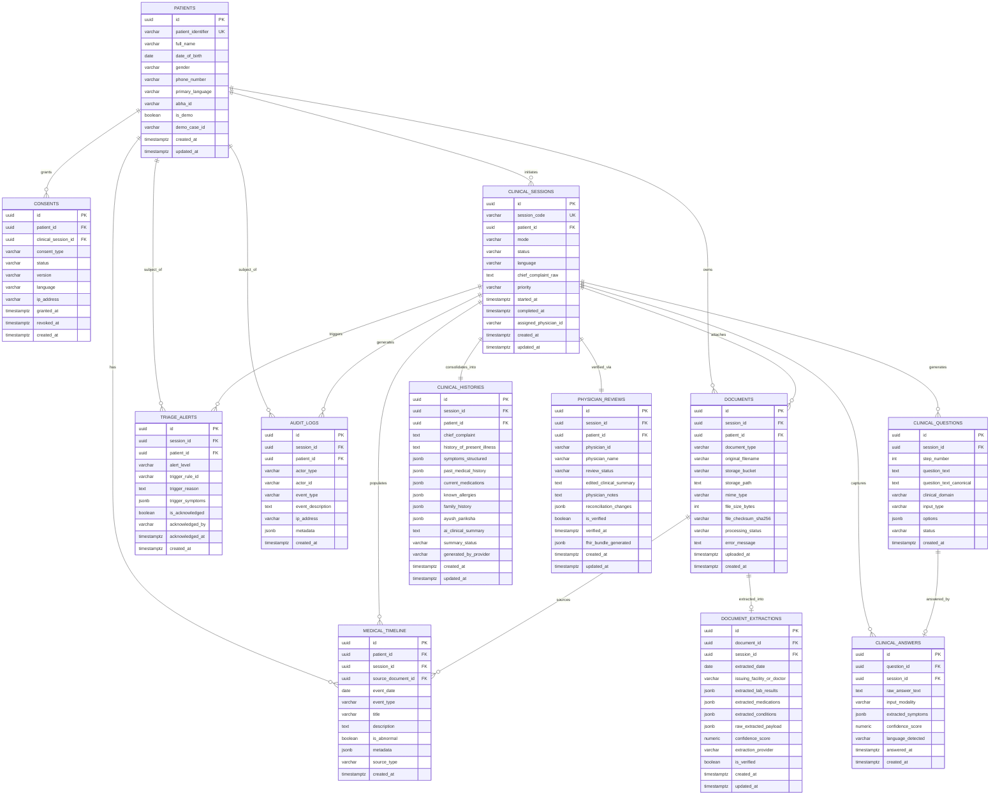

# MediKiosk — Phase 1A Database Schema Design

> **Document Status:** DESIGN ONLY — Phase 1A Architecture Specification  
> **Target Platform:** PostgreSQL 15+ / Supabase  
> **Author:** Senior Developer, MediKiosk Engineering Team  
> **SIH Problem Statement:** AI-Powered Patient Case-Taking Software (SIH 2026)  
> **Implementation Status:** NOT STARTED (Design & Architectural Specification Only)

---

## 1. Schema Overview

### 1.1 Architectural Purpose
The MediKiosk database model provides the relational backbone for transforming unstructured, conversational, multimodal patient interactions into structured, clinically validated, and interoperable medical records.

The schema is specifically optimized for the core SIH workflow:
```
Patient Arrival & Identification
  └──> Informed Consent
        └──> Multilingual Clinical Interview & Adaptive Questioning
              ├──> Deterministic Red-Flag / Safety Triage
              └──> Previous Medical Document Digitization
                    └──> Medical Timeline Generation & AI Summarization
                          └──> Physician Review, Reconciliation & Sign-off
                                └──> FHIR R4 Bundle & ABDM-Ready Adapter
```

### 1.2 Core Design Principles
1. **Clinical Rigor & Non-Over-Normalized Relational Integrity:**  
   Core workflow relationships (patient, session, questions, answers, documents, reviews, audits) are strictly normalized with strong foreign keys and delete cascades. Semi-structured clinical payloads (e.g., adaptive question options, symptom attribute sets, Dashavidha Pariksha, extracted lab values, FHIR bundles) use PostgreSQL `JSONB` to prevent relational table bloat while enabling indexing and rapid schema evolution.
2. **Safety & Provenance Separation:**  
   The schema strictly separates:
   - Raw patient-reported statements (`clinical_answers.raw_answer_text`)
   - AI-extracted structured clinical entities (`clinical_histories.symptoms_structured`, `document_extractions`)
   - Deterministic safety escalations (`triage_alerts`)
   - Verified clinician-accepted records (`physician_reviews.edited_clinical_summary`, `physician_reviews.is_verified`)
3. **Zero Real PII / Synthetic-First Architecture:**  
   Designed strictly for synthetic demonstration data in compliance with project rules (`is_demo = true`, `demo_case_id` references). No real Aadhaar or live ABHA credentials are stored.
4. **Interoperability-Ready Foundation:**  
   MediKiosk uses an application-optimized relational schema. A dedicated transformation layer will later map verified clinical data into appropriate FHIR R4 resources.

---

## 2. Entity Relationship Explanation & Diagram

### 2.1 Entity Lifecycle & Relationship Flow
1. **Patient & Consent:** A synthetic patient (`patients`) is identified at the kiosk. Before any intake question is presented or data captured, an immutable consent record (`consents`) is registered with timestamp, version, and language.
2. **Intake Session & Adaptive Dialogue:** The patient initiates a `clinical_sessions` record. As the clinical engine generates adaptive questions, they are logged in `clinical_questions`. Patient responses (text or speech transcript) are recorded in `clinical_answers`, along with AI-extracted symptom payloads.
3. **Safety / Red-Flag Engine:** If extracted symptoms match deterministic clinical criteria (e.g., chest pain + shortness of breath + sweating), a high-priority `triage_alerts` record is raised immediately, linking directly to the session and patient.
4. **Document Digitization & Extraction:** The patient uploads historical medical artifacts (prescriptions, lab tests, discharge summaries). Each file metadata record in `documents` points to an isolated object in Supabase Storage. The multimodal AI pipeline parses the document and populates `document_extractions` with normalized lab tests, medications, and dates.
5. **Timeline & Summarization:** The session aggregates historical events and newly reported conditions into `medical_timeline`. The engine generates a consolidated, physician-ready draft in `clinical_histories`.
6. **Physician Verification & Auditability:** The physician reviews the intake via the Doctor Dashboard, edits the AI draft if necessary, and marks it verified in `physician_reviews`. Every state transition, triage trigger, and sign-off is logged immutably in `audit_logs`.

### 2.2 Mermaid Entity Relationship Diagram



---

## 3. Table-by-Table Specification

### 3.1 Table: `patients`
- **Purpose:** Stores core synthetic patient demographic data and demonstration references.
- **Justification:** Essential root entity for all clinical encounters, consents, documents, and historical medical timelines.

| Column Name | PostgreSQL Data Type | Nullable | Default | Constraints | Description |
| :--- | :--- | :--- | :--- | :--- | :--- |
| `id` | `UUID` | No | `gen_random_uuid()` | `PRIMARY KEY` | Unique internal UUID identifier |
| `patient_identifier` | `VARCHAR(64)` | No | None | `UNIQUE` | Human-readable synthetic hospital identifier (e.g., `MK-2026-001`) |
| `full_name` | `VARCHAR(255)` | No | None | None | Synthetic patient full name |
| `date_of_birth` | `DATE` | No | None | None | Patient date of birth (used to calculate age at runtime) |
| `gender` | `VARCHAR(20)` | No | None | `CHECK (gender IN ('male', 'female', 'other', 'prefer_not_to_say'))` | Self-reported gender |
| `phone_number` | `VARCHAR(20)` | Yes | None | None | Synthetic/masked contact number |
| `primary_language` | `VARCHAR(10)` | No | `'en'` | `CHECK (primary_language IN ('en', 'hi', 'mr'))` | Preferred UI/intake language code |
| `abha_id` | `VARCHAR(50)` | Yes | None | None | Synthetic ABHA address (e.g., `91-0000-0001@abdm.demo`) |
| `is_demo` | `BOOLEAN` | No | `true` | None | Flag ensuring patient is purely synthetic |
| `demo_case_id` | `VARCHAR(50)` | Yes | None | None | Identifier for demo script mapping (`case_1_red_flag`, `case_2_chronic`, `case_3_ayush`) |
| `created_at` | `TIMESTAMPTZ` | No | `now()` | None | Record creation timestamp |
| `updated_at` | `TIMESTAMPTZ` | No | `now()` | None | Record modification timestamp |

> **Design Note on Patient Age:** The `age` field is intentionally not persisted in the database to maintain data normalization and prevent temporal staleness. Age should be calculated at runtime from `date_of_birth` (e.g., in application code or via SQL date difference).

- **Foreign Keys:** None (Root entity).
- **Relationships:**
  - Has many `consents` (1:N)
  - Has many `clinical_sessions` (1:N)
  - Has many `documents` (1:N)
  - Has many `medical_timeline` (1:N)
  - Has many `triage_alerts` (1:N)
  - Has many `audit_logs` (1:N)
- **Sensitive / Clinical Fields:** `full_name`, `date_of_birth`, `gender`, `phone_number` (Classified as PII/PHI; strictly synthetic). Note: Patient age is calculated dynamically at runtime from `date_of_birth` and is not stored.
- **Demo-Only Fields:** `is_demo`, `demo_case_id`, `abha_id` (demo format).

---

### 3.2 Table: `consents`
- **Purpose:** Captures explicit, legally traceable patient consent prior to initiating clinical data collection.
- **Justification:** Mandatory healthcare requirement; complies with DISHA, ABDM consent architecture, and ethical AI intake standards.

| Column Name | PostgreSQL Data Type | Nullable | Default | Constraints | Description |
| :--- | :--- | :--- | :--- | :--- | :--- |
| `id` | `UUID` | No | `gen_random_uuid()` | `PRIMARY KEY` | Unique consent identifier |
| `patient_id` | `UUID` | No | None | `REFERENCES patients(id) ON DELETE CASCADE` | Associated patient |
| `clinical_session_id` | `UUID` | Yes | None | `REFERENCES clinical_sessions(id) ON DELETE SET NULL` | Linked session (if granted within a session) |
| `consent_type` | `VARCHAR(50)` | No | `'kiosk_intake_and_ai_assistance'` | `CHECK (consent_type IN ('kiosk_intake_and_ai_assistance', 'document_digitization', 'data_sharing_abdm'))` | Scope of authorization granted |
| `status` | `VARCHAR(20)` | No | `'granted'` | `CHECK (status IN ('granted', 'revoked', 'expired'))` | Consent state |
| `version` | `VARCHAR(20)` | No | `'v1.0'` | None | Version of the displayed legal/consent terms |
| `language` | `VARCHAR(10)` | No | `'en'` | None | Language in which terms were presented and agreed |
| `ip_address` | `VARCHAR(45)` | Yes | None | None | Kiosk terminal IP/identifier for audit validation |
| `granted_at` | `TIMESTAMPTZ` | No | `now()` | None | Exact timestamp when patient touched "Agree" |
| `revoked_at` | `TIMESTAMPTZ` | Yes | None | None | Revocation timestamp if retracted |
| `created_at` | `TIMESTAMPTZ` | No | `now()` | None | Record timestamp |

- **Foreign Keys:**
  - `patient_id` -> `patients(id)` (ON DELETE CASCADE)
  - `clinical_session_id` -> `clinical_sessions(id)` (ON DELETE SET NULL)
- **Relationships:** Belongs to `patients` (N:1); optionally references `clinical_sessions` (N:1).
- **Sensitive / Clinical Fields:** Legal consent status, timestamps, and IP address.
- **Demo-Only Fields:** None (Standard compliance schema).

---

### 3.3 Table: `clinical_sessions`
- **Purpose:** Represents an active or completed patient kiosk case-taking encounter.
- **Justification:** Central transactional entity orchestrating interview questions, document uploads, red-flag triggers, and doctor reviews.

| Column Name | PostgreSQL Data Type | Nullable | Default | Constraints | Description |
| :--- | :--- | :--- | :--- | :--- | :--- |
| `id` | `UUID` | No | `gen_random_uuid()` | `PRIMARY KEY` | Unique intake session UUID |
| `session_code` | `VARCHAR(32)` | No | None | `UNIQUE` | Display code (e.g., `SES-20260908-01`) |
| `patient_id` | `UUID` | No | None | `REFERENCES patients(id) ON DELETE CASCADE` | Associated patient |
| `mode` | `VARCHAR(20)` | No | `'general'` | `CHECK (mode IN ('general', 'ayush'))` | Clinical intake mode |
| `status` | `VARCHAR(30)` | No | `'intake_active'` | `CHECK (status IN ('intake_active', 'interview_complete', 'documents_uploaded', 'ready_for_review', 'in_physician_review', 'verified', 'abandoned'))` | Operational lifecycle state |
| `language` | `VARCHAR(10)` | No | `'en'` | `CHECK (language IN ('en', 'hi', 'mr'))` | Active session language |
| `chief_complaint_raw` | `TEXT` | Yes | None | None | Verbatim initial complaint entered by patient |
| `priority` | `VARCHAR(20)` | No | `'normal'` | `CHECK (priority IN ('normal', 'urgent', 'emergency'))` | Current triage priority |
| `started_at` | `TIMESTAMPTZ` | No | `now()` | None | Session initiation timestamp |
| `completed_at` | `TIMESTAMPTZ` | Yes | None | None | Intake completion timestamp |
| `assigned_physician_id` | `VARCHAR(64)` | Yes | None | None | Assigned reviewing physician identifier |
| `created_at` | `TIMESTAMPTZ` | No | `now()` | None | Record creation timestamp |
| `updated_at` | `TIMESTAMPTZ` | No | `now()` | None | Record update timestamp |

- **Foreign Keys:** `patient_id` -> `patients(id)` (ON DELETE CASCADE).
- **Relationships:**
  - Belongs to `patients` (N:1)
  - Has many `clinical_questions` (1:N)
  - Has many `clinical_answers` (1:N)
  - Has one `clinical_histories` (1:1)
  - Has many `triage_alerts` (1:N)
  - Has many `documents` (1:N)
  - Has many `medical_timeline` (1:N)
  - Has one `physician_reviews` (1:1)
  - Has many `audit_logs` (1:N)
- **Sensitive / Clinical Fields:** `chief_complaint_raw`, `priority`, `status` (PHI).
- **Demo-Only Fields:** None.

---

### 3.4 Table: `clinical_questions`
- **Purpose:** Stores the sequence of dynamic, adaptive questions presented to the patient by the clinical intake engine.
- **Justification:** Required to trace the exact conversational path, understand why questions were asked, and prevent repetitive interrogation.

| Column Name | PostgreSQL Data Type | Nullable | Default | Constraints | Description |
| :--- | :--- | :--- | :--- | :--- | :--- |
| `id` | `UUID` | No | `gen_random_uuid()` | `PRIMARY KEY` | Unique question identifier |
| `session_id` | `UUID` | No | None | `REFERENCES clinical_sessions(id) ON DELETE CASCADE` | Associated session |
| `step_number` | `INTEGER` | No | None | `CHECK (step_number >= 1)` | Chronological sequence in intake |
| `question_text` | `TEXT` | No | None | None | Localized question text shown to patient |
| `question_text_canonical` | `TEXT` | No | None | None | Standard English canonical clinical concept |
| `clinical_domain` | `VARCHAR(50)` | No | None | `CHECK (clinical_domain IN ('chief_complaint', 'hpi_onset', 'hpi_severity', 'hpi_character', 'associated_symptoms', 'past_medical_history', 'medication_history', 'allergy_history', 'family_history', 'lifestyle_social', 'ayush_pariksha'))` | Clinical category targeted |
| `input_type` | `VARCHAR(30)` | No | None | `CHECK (input_type IN ('text', 'voice', 'multiple_choice', 'scale', 'boolean'))` | Expected UI control |
| `options` | `JSONB` | Yes | None | None | Structured quick-reply chips/options |
| `status` | `VARCHAR(20)` | No | `'presented'` | `CHECK (status IN ('presented', 'answered', 'skipped'))` | Question interaction state |
| `created_at` | `TIMESTAMPTZ` | No | `now()` | None | Question generation timestamp |

- **Foreign Keys:** `session_id` -> `clinical_sessions(id)` (ON DELETE CASCADE).
- **Relationships:**
  - Belongs to `clinical_sessions` (N:1)
  - Has one optional `clinical_answers` (1:1)
- **Sensitive / Clinical Fields:** `question_text`, `clinical_domain`.
- **Demo-Only Fields:** None.

---

### 3.5 Table: `clinical_answers`
- **Purpose:** Records the patient's verbatim response along with real-time AI symptom extraction.
- **Justification:** Preserves the patient's voice faithfully (safety requirement) while structuring clinical variables for downstream evaluation.

| Column Name | PostgreSQL Data Type | Nullable | Default | Constraints | Description |
| :--- | :--- | :--- | :--- | :--- | :--- |
| `id` | `UUID` | No | `gen_random_uuid()` | `PRIMARY KEY` | Unique answer identifier |
| `question_id` | `UUID` | No | None | `REFERENCES clinical_questions(id) ON DELETE CASCADE` | Question being answered |
| `session_id` | `UUID` | No | None | `REFERENCES clinical_sessions(id) ON DELETE CASCADE` | Session parent |
| `raw_answer_text` | `TEXT` | No | None | None | Verbatim typed or transcribed text |
| `input_modality` | `VARCHAR(20)` | No | `'text'` | `CHECK (input_modality IN ('text', 'voice_browser', 'voice_bhashini', 'touch_choice'))` | How the response was provided |
| `extracted_symptoms` | `JSONB` | Yes | `'[]'` | None | Structured symptoms extracted from this specific answer |
| `confidence_score` | `NUMERIC(3,2)` | Yes | None | `CHECK (confidence_score >= 0.0 AND confidence_score <= 1.0)` | Extraction confidence (0.00 to 1.00) |
| `language_detected` | `VARCHAR(10)` | No | `'en'` | None | Language of the input |
| `answered_at` | `TIMESTAMPTZ` | No | `now()` | None | Exact timestamp of response |
| `created_at` | `TIMESTAMPTZ` | No | `now()` | None | Database persistence timestamp |

- **Foreign Keys:**
  - `question_id` -> `clinical_questions(id)` (ON DELETE CASCADE)
  - `session_id` -> `clinical_sessions(id)` (ON DELETE CASCADE)
- **Relationships:**
  - Belongs to `clinical_questions` (1:1)
  - Belongs to `clinical_sessions` (N:1)
- **Sensitive / Clinical Fields:** `raw_answer_text`, `extracted_symptoms` (PHI).
- **Demo-Only Fields:** None.

---

### 3.6 Table: `clinical_histories`
- **Purpose:** Consolidated structured clinical history record and AI-generated physician summary.
- **Justification:** Directly fulfills the SIH requirement for a comprehensive, structured clinical history that saves physician time without starting from zero.

| Column Name | PostgreSQL Data Type | Nullable | Default | Constraints | Description |
| :--- | :--- | :--- | :--- | :--- | :--- |
| `id` | `UUID` | No | `gen_random_uuid()` | `PRIMARY KEY` | Unique clinical history UUID |
| `session_id` | `UUID` | No | None | `UNIQUE`, `REFERENCES clinical_sessions(id) ON DELETE CASCADE` | 1-to-1 link with intake session |
| `patient_id` | `UUID` | No | None | `REFERENCES patients(id) ON DELETE CASCADE` | Subject patient |
| `chief_complaint` | `TEXT` | No | None | None | Canonical chief complaint |
| `history_of_present_illness` | `TEXT` | No | None | None | Narrative HPI synthesized from interview |
| `symptoms_structured` | `JSONB` | No | `'[]'` | None | Array of symptom objects (name, onset, duration, severity, location, modifiers) |
| `past_medical_history` | `JSONB` | No | `'[]'` | None | Array of previous chronic conditions/surgeries |
| `current_medications` | `JSONB` | No | `'[]'` | None | Patient-reported active medications |
| `known_allergies` | `JSONB` | No | `'[]'` | None | Patient-reported drug/food allergies |
| `family_history` | `JSONB` | No | `'[]'` | None | Hereditary condition entries |
| `ayush_pariksha` | `JSONB` | Yes | None | None | Structured Dashavidha Pariksha assessment if mode = `ayush` |
| `ai_clinical_summary` | `TEXT` | No | None | None | Physician-ready synthetic summary text |
| `summary_status` | `VARCHAR(30)` | No | `'generated'` | `CHECK (summary_status IN ('generated', 'edited_by_physician', 'verified'))` | Status of AI summary |
| `generated_by_provider` | `VARCHAR(50)` | No | `'mock'` | None | Provider used (`gemini-1.5-pro`, `mock_ai_provider`) |
| `created_at` | `TIMESTAMPTZ` | No | `now()` | None | Generation timestamp |
| `updated_at` | `TIMESTAMPTZ` | No | `now()` | None | Last edit timestamp |

- **Foreign Keys:**
  - `session_id` -> `clinical_sessions(id)` (ON DELETE CASCADE)
  - `patient_id` -> `patients(id)` (ON DELETE CASCADE)
- **Relationships:** Belongs to `clinical_sessions` (1:1); belongs to `patients` (N:1).
- **Sensitive / Clinical Fields:** Entire table is high-sensitivity PHI.
- **Demo-Only Fields:** `generated_by_provider` handles fallback auditing.

---

### 3.7 Table: `triage_alerts`
- **Purpose:** Stores red-flag safety alerts generated by the deterministic rule engine.
- **Justification:** Core medical safety principle (AI Context §7). Never leaves red-flag detection to unconstrained LLM hallucinations; preserves explicit rules and physician acknowledgments.

| Column Name | PostgreSQL Data Type | Nullable | Default | Constraints | Description |
| :--- | :--- | :--- | :--- | :--- | :--- |
| `id` | `UUID` | No | `gen_random_uuid()` | `PRIMARY KEY` | Alert UUID |
| `session_id` | `UUID` | No | None | `REFERENCES clinical_sessions(id) ON DELETE CASCADE` | Associated session |
| `patient_id` | `UUID` | No | None | `REFERENCES patients(id) ON DELETE CASCADE` | Subject patient |
| `alert_level` | `VARCHAR(20)` | No | None | `CHECK (alert_level IN ('info', 'warning', 'critical_red_flag'))` | Severity of safety trigger |
| `trigger_rule_id` | `VARCHAR(64)` | No | None | None | Identifier of deterministic rule (e.g., `RULE_CARDIAC_RED_FLAG_01`) |
| `trigger_reason` | `TEXT` | No | None | None | Explainable trigger explanation shown to clinician |
| `trigger_symptoms` | `JSONB` | No | None | None | Exact symptom array that triggered rule |
| `is_acknowledged` | `BOOLEAN` | No | `false` | None | Whether clinician has viewed and cleared alert |
| `acknowledged_by` | `VARCHAR(64)` | Yes | None | None | Physician ID who acknowledged alert |
| `acknowledged_at` | `TIMESTAMPTZ` | Yes | None | None | Timestamp of acknowledgment |
| `created_at` | `TIMESTAMPTZ` | No | `now()` | None | Alert firing timestamp |

- **Foreign Keys:**
  - `session_id` -> `clinical_sessions(id)` (ON DELETE CASCADE)
  - `patient_id` -> `patients(id)` (ON DELETE CASCADE)
- **Relationships:** Belongs to `clinical_sessions` (N:1); belongs to `patients` (N:1).
- **Sensitive / Clinical Fields:** High-priority clinical safety alert and reason.
- **Demo-Only Fields:** None (Used heavily in Demo Case 1).

---

### 3.8 Table: `documents`
- **Purpose:** Manages previous medical document files uploaded by the patient and links them to Supabase Storage objects.
- **Justification:** Digitization of physical prescriptions, lab reports, and discharge summaries is a primary SIH problem statement requirement.

| Column Name | PostgreSQL Data Type | Nullable | Default | Constraints | Description |
| :--- | :--- | :--- | :--- | :--- | :--- |
| `id` | `UUID` | No | `gen_random_uuid()` | `PRIMARY KEY` | Document database ID |
| `session_id` | `UUID` | No | None | `REFERENCES clinical_sessions(id) ON DELETE CASCADE` | Intake session in which file was uploaded |
| `patient_id` | `UUID` | No | None | `REFERENCES patients(id) ON DELETE CASCADE` | Patient owner |
| `document_type` | `VARCHAR(50)` | No | None | `CHECK (document_type IN ('prescription', 'lab_report', 'discharge_summary', 'radiology_report', 'other'))` | Category of document |
| `original_filename` | `VARCHAR(255)` | No | None | None | Original filename provided by user |
| `storage_bucket` | `VARCHAR(64)` | No | `'medical-documents'` | None | Supabase Storage bucket name |
| `storage_path` | `TEXT` | No | None | None | Exact object path in storage bucket |
| `mime_type` | `VARCHAR(100)` | No | None | `CHECK (mime_type IN ('image/jpeg', 'image/png', 'image/webp', 'application/pdf'))` | Verified MIME type |
| `file_size_bytes` | `INTEGER` | No | None | `CHECK (file_size_bytes > 0 AND file_size_bytes <= 15728640)` | File size (max 15MB) |
| `file_checksum_sha256`| `VARCHAR(64)` | Yes | None | None | Integrity hash of the file |
| `processing_status` | `VARCHAR(30)` | No | `'uploaded'` | `CHECK (processing_status IN ('uploaded', 'processing', 'completed', 'failed'))` | Pipeline processing status |
| `error_message` | `TEXT` | Yes | None | None | Failure details if processing failed |
| `uploaded_at` | `TIMESTAMPTZ` | No | `now()` | None | Upload timestamp |
| `created_at` | `TIMESTAMPTZ` | No | `now()` | None | Record persistence timestamp |

- **Foreign Keys:**
  - `session_id` -> `clinical_sessions(id)` (ON DELETE CASCADE)
  - `patient_id` -> `patients(id)` (ON DELETE CASCADE)
- **Relationships:**
  - Belongs to `clinical_sessions` (N:1)
  - Belongs to `patients` (N:1)
  - Has one `document_extractions` (1:1)
  - Has many `medical_timeline` entries (1:N)
- **Sensitive / Clinical Fields:** Document metadata, storage path (PHI).
- **Demo-Only Fields:** None.

---

### 3.9 Table: `document_extractions`
- **Purpose:** Stores the validated, structured clinical information extracted by the multimodal AI model from uploaded documents.
- **Justification:** Eliminates manual data entry for physicians by turning static PDFs/images into queryable lab values and medication orders.

| Column Name | PostgreSQL Data Type | Nullable | Default | Constraints | Description |
| :--- | :--- | :--- | :--- | :--- | :--- |
| `id` | `UUID` | No | `gen_random_uuid()` | `PRIMARY KEY` | Extraction UUID |
| `document_id` | `UUID` | No | None | `UNIQUE`, `REFERENCES documents(id) ON DELETE CASCADE` | 1-to-1 link with source document |
| `session_id` | `UUID` | No | None | `REFERENCES clinical_sessions(id) ON DELETE CASCADE` | Session parent |
| `extracted_date` | `DATE` | Yes | None | None | Date printed on prescription/report |
| `issuing_facility_or_doctor` | `VARCHAR(255)` | Yes | None | None | Hospital, clinic, or doctor name on document |
| `extracted_lab_results` | `JSONB` | No | `'[]'` | None | Array of: `{test_name, value, unit, reference_range, is_abnormal}` |
| `extracted_medications` | `JSONB` | No | `'[]'` | None | Array of: `{medicine_name, dosage, frequency, route, duration}` |
| `extracted_conditions` | `JSONB` | No | `'[]'` | None | Array of: `{condition_name, icd10_code, status}` |
| `raw_extracted_payload` | `JSONB` | No | None | None | Complete validated JSON returned by AI provider |
| `confidence_score` | `NUMERIC(3,2)` | Yes | None | `CHECK (confidence_score >= 0.0 AND confidence_score <= 1.0)` | Extraction confidence score |
| `extraction_provider` | `VARCHAR(50)` | No | `'mock'` | None | Provider used (`gemini-1.5-flash`, `mock_ai_provider`) |
| `is_verified` | `BOOLEAN` | No | `false` | None | True once doctor confirms extracted facts |
| `created_at` | `TIMESTAMPTZ` | No | `now()` | None | Extraction timestamp |
| `updated_at` | `TIMESTAMPTZ` | No | `now()` | None | Verification timestamp |

- **Foreign Keys:**
  - `document_id` -> `documents(id)` (ON DELETE CASCADE)
  - `session_id` -> `clinical_sessions(id)` (ON DELETE CASCADE)
- **Relationships:** Belongs to `documents` (1:1); belongs to `clinical_sessions` (N:1).
- **Sensitive / Clinical Fields:** Entire table contains digitized clinical PHI.
- **Demo-Only Fields:** `extraction_provider` tracks mock fallback.

---

### 3.10 Table: `medical_timeline`
- **Purpose:** Stores chronological clinical milestones (past diagnoses, medication starts, lab reports, encounters).
- **Justification:** Directly powers the Physician Medical Timeline view so the doctor can visualize longitudinal patient trajectory in seconds.

| Column Name | PostgreSQL Data Type | Nullable | Default | Constraints | Description |
| :--- | :--- | :--- | :--- | :--- | :--- |
| `id` | `UUID` | No | `gen_random_uuid()` | `PRIMARY KEY` | Timeline event UUID |
| `patient_id` | `UUID` | No | None | `REFERENCES patients(id) ON DELETE CASCADE` | Subject patient |
| `session_id` | `UUID` | No | None | `REFERENCES clinical_sessions(id) ON DELETE CASCADE` | Associated session |
| `source_document_id` | `UUID` | Yes | None | `REFERENCES documents(id) ON DELETE SET NULL` | Linked document (if extracted from upload) |
| `event_date` | `DATE` | No | None | None | Exact date or best estimated date of event |
| `event_type` | `VARCHAR(30)` | No | None | `CHECK (event_type IN ('condition', 'medication', 'investigation_lab', 'encounter', 'procedure', 'intake_assessment'))` | Category of timeline node |
| `title` | `VARCHAR(255)` | No | None | None | Short heading (e.g., `HbA1c: 8.4% (Abnormal)`) |
| `description` | `TEXT` | Yes | None | None | Contextual details or medication instructions |
| `is_abnormal` | `BOOLEAN` | No | `false` | None | Highlighting flag for quick visual triaging |
| `metadata` | `JSONB` | Yes | None | None | Structured payload (e.g., `{test: "HbA1c", value: 8.4, unit: "%"}`) |
| `source_type` | `VARCHAR(30)` | No | None | `CHECK (source_type IN ('patient_reported', 'extracted_from_document', 'kiosk_session', 'physician_entry'))` | Provenance of the timeline entry |
| `created_at` | `TIMESTAMPTZ` | No | `now()` | None | Record timestamp |

- **Foreign Keys:**
  - `patient_id` -> `patients(id)` (ON DELETE CASCADE)
  - `session_id` -> `clinical_sessions(id)` (ON DELETE CASCADE)
  - `source_document_id` -> `documents(id)` (ON DELETE SET NULL)
- **Relationships:** Belongs to `patients` (N:1); belongs to `clinical_sessions` (N:1); optionally belongs to `documents` (N:1).
- **Sensitive / Clinical Fields:** Longitudinal clinical history (PHI).
- **Demo-Only Fields:** None.

---

### 3.11 Table: `physician_reviews`
- **Purpose:** Captures the physician's review, modifications, and formal verification of the patient case.
- **Justification:** Core architectural mandate: "The physician remains the final decision-maker." Prevents unverified AI output from becoming an unreviewed medical record.

| Column Name | PostgreSQL Data Type | Nullable | Default | Constraints | Description |
| :--- | :--- | :--- | :--- | :--- | :--- |
| `id` | `UUID` | No | `gen_random_uuid()` | `PRIMARY KEY` | Review record UUID |
| `session_id` | `UUID` | No | None | `UNIQUE`, `REFERENCES clinical_sessions(id) ON DELETE CASCADE` | 1-to-1 link with reviewed session |
| `patient_id` | `UUID` | No | None | `REFERENCES patients(id) ON DELETE CASCADE` | Subject patient |
| `physician_id` | `VARCHAR(64)` | No | None | None | Professional identifier / registration number |
| `physician_name` | `VARCHAR(255)` | No | None | None | Reviewing physician full name |
| `review_status` | `VARCHAR(20)` | No | `'pending'` | `CHECK (review_status IN ('pending', 'in_review', 'verified_accepted', 'rejected', 'amended'))` | Clinical review state |
| `edited_clinical_summary`| `TEXT` | Yes | None | None | Physician-edited clinical summary (final version) |
| `physician_notes` | `TEXT` | Yes | None | None | Attending doctor's clinical impressions |
| `reconciliation_changes`| `JSONB` | Yes | None | None | Audit diff showing modifications from raw AI summary |
| `is_verified` | `BOOLEAN` | No | `false` | None | True only when doctor clicks "Verify & Accept" |
| `verified_at` | `TIMESTAMPTZ` | Yes | None | None | Exact timestamp of doctor verification |
| `fhir_bundle_generated`| `JSONB` | Yes | None | None | Deterministically generated FHIR R4 Bundle |
| `created_at` | `TIMESTAMPTZ` | No | `now()` | None | Record initiation timestamp |
| `updated_at` | `TIMESTAMPTZ` | No | `now()` | None | Verification update timestamp |

- **Foreign Keys:**
  - `session_id` -> `clinical_sessions(id)` (ON DELETE CASCADE)
  - `patient_id` -> `patients(id)` (ON DELETE CASCADE)
- **Relationships:** Belongs to `clinical_sessions` (1:1); belongs to `patients` (N:1).
- **Sensitive / Clinical Fields:** Final verified clinical summary and physician notes (Official Legal Medical Record).
- **Demo-Only Fields:** None.

---

### 3.12 Table: `audit_logs`
- **Purpose:** Provides an append-only, tamper-evident audit trail for all significant clinical, consent, AI, and verification events.
- **Justification:** Mandatory for healthcare data protection (DISHA, ABDM, HIPAA principles); guarantees accountability for every autonomous or human action.

| Column Name | PostgreSQL Data Type | Nullable | Default | Constraints | Description |
| :--- | :--- | :--- | :--- | :--- | :--- |
| `id` | `UUID` | No | `gen_random_uuid()` | `PRIMARY KEY` | Audit entry UUID |
| `session_id` | `UUID` | Yes | None | `REFERENCES clinical_sessions(id) ON DELETE SET NULL` | Associated intake session |
| `patient_id` | `UUID` | Yes | None | `REFERENCES patients(id) ON DELETE SET NULL` | Subject patient |
| `actor_type` | `VARCHAR(20)` | No | None | `CHECK (actor_type IN ('patient_kiosk', 'physician', 'ai_system', 'system_job'))` | Initiating actor |
| `actor_id` | `VARCHAR(64)` | No | None | None | Identifier (e.g., `kiosk-terminal-01`, `dr_sharma_104`) |
| `event_type` | `VARCHAR(64)` | No | None | `CHECK (event_type IN ('consent_granted', 'consent_revoked', 'session_started', 'answer_recorded', 'red_flag_triggered', 'document_uploaded', 'document_extracted', 'summary_generated', 'summary_edited', 'case_verified', 'fhir_exported', 'abdm_payload_prepared'))` | Standardized event taxonomy |
| `event_description` | `TEXT` | No | None | None | Human-readable audit narrative |
| `ip_address` | `VARCHAR(45)` | Yes | None | None | Originating network IP address |
| `metadata` | `JSONB` | Yes | None | None | Structured contextual snapshot of event |
| `created_at` | `TIMESTAMPTZ` | No | `now()` | None | Immutable record timestamp |

- **Foreign Keys:**
  - `session_id` -> `clinical_sessions(id)` (ON DELETE SET NULL)
  - `patient_id` -> `patients(id)` (ON DELETE SET NULL)
- **Relationships:** Belongs to `clinical_sessions` (N:1); belongs to `patients` (N:1).
- **Sensitive / Clinical Fields:** Security and compliance metadata.
- **Demo-Only Fields:** None.

---

## 4. Storage Design

### 4.1 Supabase Storage Bucket Configuration
Uploaded medical documents are stored in an isolated Supabase Storage bucket rather than in the relational database.

- **Bucket Name:** `medical-documents`
- **Public Access:** `FALSE` (Strictly private bucket. Public URLs are completely prohibited).
- **File Size Limit:** 15MB per file (`15728640 bytes`).
- **Allowed MIME Types:**
  - `image/jpeg` (`.jpg`, `.jpeg`)
  - `image/png` (`.png`)
  - `image/webp` (`.webp`)
  - `application/pdf` (`.pdf`)

### 4.2 Object Path Naming Convention
Objects are organized hierarchically to enforce session isolation and simple cleanup:
```
medical-documents/
  └── patients/
        └── {patient_id}/
              └── sessions/
                    └── {session_id}/
                          └── {document_id}_{sanitized_basename}.{ext}
```
*Example:*  
`patients/c3b9b462-8172-4b21-a3f2-1d5738848a60/sessions/e4a1d520-22c9-4b82-93bf-4c7401dce991/f89a12c4-33a1-4321-b012-999333222111_lab_report_hba1c.pdf`

### 4.3 Database Record to Storage Object Linkage
The `documents` table acts as the authoritative pointer to the storage object:
- `documents.storage_bucket`: Stores bucket identifier (`'medical-documents'`).
- `documents.storage_path`: Stores relative object path.
- `documents.mime_type` & `documents.file_size_bytes`: Validated before insertion.
- `documents.file_checksum_sha256`: Computed server-side to guarantee file integrity.

### 4.4 Secure Access Pattern
1. **Upload:**  
   The client uploads the file via Next.js Server Actions using the server-side Supabase client. Direct unauthenticated client uploads to the bucket are disabled.
2. **Physician Document Viewing:**  
   When a physician views a document in `/doctor/patients/[id]`, the server generates a time-limited **Signed URL** (valid for 15 minutes max via `createSignedUrl`). The raw storage URL is never exposed publicly.
3. **Deletion Cascade Policy:**  
   If a session or patient is deleted (e.g., test session reset), a database trigger or cleanup job removes all associated objects under `patients/{patient_id}/sessions/{session_id}/`.

---

## 5. Security & Row Level Security (RLS) Considerations

### 5.1 Healthcare Threat Model
A clinical kiosk operates in a semi-public hospital waiting room, while the Doctor Dashboard operates on a clinician workstation. The security design must guarantee:
- **Kiosk Isolation:** A patient using a kiosk terminal can never see other patients' records or browse queue lists.
- **Provider Authentication:** Only authenticated physicians can access the clinical review queue, red-flag triage center, and full summaries.
- **Tamper-Proof Audit Logging:** Audit records can only be written by system triggers or backend service-role operations; they cannot be updated or deleted by any user.

### 5.2 Role Definitions
1. `anon` (Kiosk Client):
   - Unauthenticated browser session running at the kiosk.
   - Restricted write access to initiate intake sessions and upload documents for the active session.
   - Zero read access to general tables (`patients`, `clinical_sessions`, `clinical_histories`, etc.).
2. `authenticated` (Physician / Clinical Staff):
   - Authenticated healthcare professional.
   - Read access to clinical queues, patient histories, triage alerts, and document extractions.
   - Write access to `physician_reviews` and `triage_alerts.is_acknowledged`.
3. `service_role` (Next.js Server Actions / API Routes):
   - Privileged server-side execution context.
   - Manages AI provider interactions, runs the deterministic red-flag engine, and writes immutable `audit_logs`.
   - Never exposed to the client browser.

### 5.3 Proposed RLS Policies (Specification Only — To be implemented in Phase 1B/1C)

```sql
-- Conceptual RLS Specifications (Do not execute yet)

-- 1. patients table
ALTER TABLE patients ENABLE ROW LEVEL SECURITY;
-- Physicians can view synthetic demo patients
CREATE POLICY physician_read_patients ON patients 
    FOR SELECT TO authenticated USING (true);
-- Kiosk can insert new synthetic patient records
CREATE POLICY kiosk_create_patient ON patients 
    FOR INSERT TO anon WITH CHECK (is_demo = true);

-- 2. clinical_sessions table
ALTER TABLE clinical_sessions ENABLE ROW LEVEL SECURITY;
-- Physicians can view all sessions in the department
CREATE POLICY physician_read_sessions ON clinical_sessions 
    FOR SELECT TO authenticated USING (true);
-- Kiosk can insert and update only their current session
CREATE POLICY kiosk_manage_own_session ON clinical_sessions 
    FOR ALL TO anon USING (id = current_setting('app.current_session_id', true)::uuid);

-- 3. triage_alerts table
ALTER TABLE triage_alerts ENABLE ROW LEVEL SECURITY;
-- Authenticated physicians have full view of triage alerts
CREATE POLICY physician_view_alerts ON triage_alerts 
    FOR SELECT TO authenticated USING (true);
-- Physicians can acknowledge alerts
CREATE POLICY physician_ack_alerts ON triage_alerts 
    FOR UPDATE TO authenticated 
    USING (true) WITH CHECK (is_acknowledged = true);

-- 4. physician_reviews table
ALTER TABLE physician_reviews ENABLE ROW LEVEL SECURITY;
-- Only authenticated physicians can view and modify physician reviews
CREATE POLICY physician_manage_reviews ON physician_reviews 
    FOR ALL TO authenticated USING (true);

-- 5. audit_logs table
ALTER TABLE audit_logs ENABLE ROW LEVEL SECURITY;
-- Strictly append-only; SELECT allowed only for clinical administrators
CREATE POLICY physician_view_audit ON audit_logs 
    FOR SELECT TO authenticated USING (true);
-- No direct client UPDATE or DELETE on audit_logs under any role
```

### 5.4 Data Masking & PII Protection
- All patient records will have `is_demo = true` in demo environments.
- Real Aadhaar numbers or ABHA card photos must never be uploaded or stored. Synthetic ABHA IDs use the `.demo` sandbox suffix.
- Phone numbers and identifying numbers are masked in UI presentations (e.g., `+91 98XXX-XX123`).

---

## 6. Synthetic Demo-Data Considerations

### 6.1 Demo Segregation Architecture
To satisfy Rule 14 ("All demo patient information must be synthetic. Never insert real patient information"), the schema includes:
1. `patients.is_demo` (`BOOLEAN DEFAULT true`): Guarantees clear segregation.
2. `patients.demo_case_id` (`VARCHAR(50)`): Links directly to the three official SIH demonstration scenarios.

### 6.2 Pre-Configured Demo Cases

```
┌───────────────────────────────────────────────────────────────────────────┐
│                           SYNTHETIC DEMO CASES                            │
├──────────────────────┬──────────────────────┬─────────────────────────────┤
│ Demo Case 1          │ Demo Case 2          │ Demo Case 3                 │
│ 'case_1_red_flag'    │ 'case_2_chronic'     │ 'case_3_ayush'              │
├──────────────────────┼──────────────────────┼─────────────────────────────┤
│ Priority / Red Flag  │ Chronic Patient      │ AYUSH Integration           │
│ Symptoms:            │ History:             │ Intake Mode: AYUSH          │
│ - Chest pain         │ - Hypertension       │ Model:                      │
│ - Shortness of breath│ - Type 2 Diabetes    │ - Dashavidha Pariksha       │
│ - Diaphoresis        │ Artifacts:           │ - Prakriti assessment       │
│ Outcome:             │ - Prescription       │ - Dhatus & Agni balance     │
│ Deterministic        │ - Lab report (HbA1c) │ Outcome:                    │
│ Critical Alert       │ Outcome:             │ Distinct traditional        │
│ Triggered            │ Timeline & Abnormal  │ structured health record    │
│                      │ Flagging             │                             │
└──────────────────────┴──────────────────────┴─────────────────────────────┘
```

### 6.3 Re-seeding & Reset Strategy
A dedicated seed/reset script (to be introduced in Phase 1C) can delete and re-insert records where `is_demo = true` without modifying database schema or disrupting application stability.

---

## 7. Future FHIR R4 & ABDM Mapping Notes

### 7.1 FHIR R4 Mapping Architecture & Alignment Matrix
MediKiosk uses an application-optimized relational schema. A dedicated transformation layer will later map verified clinical data into appropriate FHIR R4 resources. No LLM hallucination is used to synthesize FHIR bundles.

The conceptual mapping targets for this transformation layer are outlined below:

| MediKiosk Internal Table | Target FHIR R4 Resource | Key Mapping Fields |
| :--- | :--- | :--- |
| `patients` | `Patient` | `id` -> `Patient.id`, `patient_identifier` -> `Patient.identifier`, `full_name` -> `Patient.name`, `gender` -> `Patient.gender`, `date_of_birth` -> `Patient.birthDate` |
| `consents` | `Consent` | `status` -> `Consent.status`, `consent_type` -> `Consent.category`, `granted_at` -> `Consent.dateTime`, `patient_id` -> `Consent.patient` |
| `clinical_sessions` | `Encounter` | `id` -> `Encounter.id`, `status` -> `Encounter.status`, `started_at` -> `Encounter.period.start`, `priority` -> `Encounter.priority` |
| `clinical_histories` | `Condition`, `AllergyIntolerance` | `symptoms_structured` -> `Condition` (code, onsetDateTime, clinicalStatus), `known_allergies` -> `AllergyIntolerance` |
| `clinical_answers` | `Observation` | `extracted_symptoms` -> `Observation.component` with LOINC / SNOMED CT terminology placeholders |
| `documents` | `DocumentReference` | `storage_path` -> `DocumentReference.content.attachment.url`, `mime_type` -> `contentType`, `document_type` -> `DocumentReference.category` |
| `document_extractions` | `Observation`, `MedicationRequest` | `extracted_lab_results` -> `Observation` (valueQuantity, referenceRange, interpretation), `extracted_medications` -> `MedicationRequest` |
| `physician_reviews` | `Composition` | `edited_clinical_summary` -> `Composition.section.text`, `physician_id` -> `Composition.author`, `verified_at` -> `Composition.date` |
| Entire Case Review | `Bundle` | `type: "document"` aggregating `Composition`, `Patient`, `Encounter`, `Condition`, `Observation`, `DocumentReference` |

### 7.2 ABDM (Ayushman Bharat Digital Mission) Milestones Alignment
- **Milestone 1 (M1 - ABHA Creation & Verification):**  
  `patients.abha_id` provides the anchor for storing ABHA addresses and numbers.
- **Milestone 2 (M2 - HIP / Health Information Provider):**  
  The `physician_reviews.fhir_bundle_generated` payload contains the verified FHIR CareContext bundle ready to be linked and shared via the ABDM Gateway upon patient consent.
- **Milestone 3 (M3 - HIU / Health Information User & Consent Manager):**  
  The `consents` table models the consent artifact lifecycle (ID, validity period, hip/hiu permissions), matching the ABDM Consent Manager specification.

---

## 8. Explicit List of Exclusions from Phase 1A

To strictly honor Phase 1A rules ("DESIGN ONLY — Do NOT create database tables yet"), the following items are **intentionally excluded**:

1. **No Database Table Creation:** No tables, extensions, types, or indexes have been executed in PostgreSQL or Supabase.
2. **No Application Code Modifications:** No existing Next.js frontend pages, components, layout shells, or hooks have been altered.
3. **No Migration Files:** No SQL migration scripts (e.g., `supabase/migrations/`) have been committed.
4. **No Supabase Connection:** No `@supabase/supabase-js` client has been initialized or linked in the application runtime.
5. **No Authentication Implementation:** Supabase Auth, login sessions, and JWT validations remain unimplemented.
6. **No AI or Multimodal Integration:** Gemini API calls, prompt templates, and AI providers remain inactive.
7. **No OCR or Vision Processing:** No document parsing or image extraction code has been written.
8. **No Speech/Voice Processing:** Browser speech recognition and Bhashini integrations remain unbuilt.
9. **No Vector / RAG Search:** In accordance with Architectural Decision D011/D012, no vector databases, pgvector, or embeddings are included.
10. **No Live ABDM Integration:** In accordance with Architectural Decision D008, live government sandbox API connections are excluded.
11. **No Package Installations:** No `npm` packages have been installed during this task.
12. **No Analytics:** No third-party tracking or telemetry tables have been created.

---

## 9. Verification & Conclusion

- **Design Completeness:** All 12 tables matching `ARCHITECTURE.md` and `ROADMAP.md` Phase 1 are specified in rigorous detail.
- **Relationships Defined:** Foreign keys, cascades, data types, nullabilities, and check constraints are completely articulated.
- **Safety & Storage Documented:** Supabase Storage integration, RLS policy blueprints, and deterministic red-flag safety layers are formalized.
- **Scope Compliance:** Strict "Design Only" posture maintained. Zero code or database modifications were performed.
